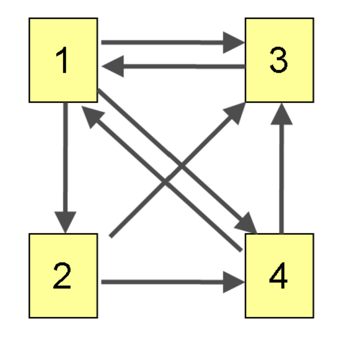

# Google
## PageRank Algorithm
## Importance Score
## Backlink

A page is important if it is pointed to by **many** other pages or by other **important** pages.

Each page indexed by a number $1, 2, ..., n$  
Represent each forward link by an arrow

Denote $x_i$ as the importance score of page $i$

R0: Without taking into account the hyperlink structure of the web, all pages are equally important with the same score 1.

R1: A page has higher score if it is pointed to by more pages.
R2: A page has higher score if it is pointed to other important pages.

$$b_{i, j} = \begin{cases} W_j \quad \text{if page $i$ has a backlink from page $j$} \\ 0 \quad \text{otherwise} \end{cases}$$

$N_i$: the number of outward links from page $i$  
$W_i = \frac{1}{N_i}$  
Compute $x_1, x_2, ..., x_n$

Further update the score  
$x_i = \sum x_jb_{ij}$  
Iteration

Converge:
$Ax^* = x^*$

Limiting scores:
If one can travel from any given page to any other given page (matrix irreducible), then,  
The set of scores will converge, or the average of scores of converge

## Eigenvector
$Aw = 1w$: $w$ is a 1-eigenvector of $A$

## Column Stochastic Matrix
All entries are non-negative, and all column sums = 1