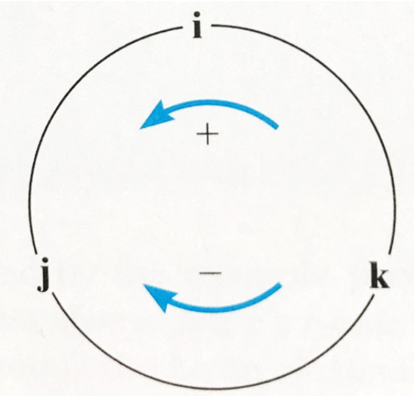
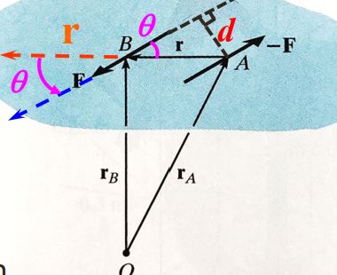

# Force Vectors
Specify angle:
$$\theta = \tan^{-1}\frac{F_y}{F_x}$$
North 45 degrees West direction

<!-- more -->

## 3D Cartesian Plane
$$\vec{A} = A_x\vec{i} + A_y\vec{j} + A_z\vec{k}$$
$$\cos \alpha = \frac{A_x}{A}$$
$$\text{Unit vector } \hat{A} = \frac{\vec{A}}{|\vec{A}|} = \cos\alpha\vec{i} + \cos\beta\vec{j} + \cos\gamma\vec{k}$$
Check:
$$\cos^2\alpha + \cos^2\beta + \cos^2\gamma = 1$$

## Position Vectors
$$\vec{r} = x\vec{i} + y\vec{j} + z\vec{k}$$

## Force Vector Directed along a Line
$$\vec{F} = |\vec{F}| \times \hat{r}$$

# Moment
d: moment arm/level arm  
Sign convention: Counterclockwise - positive z direction

$\vec{i}\times\vec{k} = -\vec{j}, \vec{i}\times\vec{i} = \vec{0}$

$$\begin{split}
\vec{A} \times \vec{B} &= (A_x\vec{i} + A_y\vec{j} + A_z\vec{k}) \times (B_x\vec{i} + B_y\vec{j} + B_z\vec{k}) \\ &= (A_yB_z - A_zB_y)\vec{i} - (A_xB_z - A_zB_x)\vec{j} + (A_xB_y - A_yB_x)\vec{k} \end{split} $$
$$\vec{A} \times \vec{B} = \det \left(\begin{vmatrix}
    \vec{i} & \vec{j} & \vec{k} \\
    A_x & A_y & A_z \\ 
    B_x & B_y & B_z
\end{vmatrix}\right)$$

Magnitude: $M_0 = rF\sin \theta$  
$\vec{M_0} = \vec{r} \times \vec{F}$  
Note: $\vec{r} \times \vec{F} \neq \vec{F} \times \vec{r}$

## Couple
### Moment of a Couple
$$\vec{M_0} = \vec{r_B}\times\vec{F} + \vec{r_A}\times(-\vec{F}) = \vec{r} \times \vec{F}$$
Magnitude:
$M_0 = Fd$

